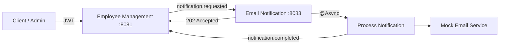

# Employee Management Platform

> A Spring Boot backend for employee, department, user, and PF account management, built to demonstrate secure REST APIs and asynchronous service-to-service communication.

> **What makes this project interesting:** employee onboarding is decoupled from notification processing. The Employee Service starts the notification workflow, the Notification Service processes it asynchronously, and a secured webhook reports completion back to the Employee Service.

[](https://www.oracle.com/java/)
[](https://spring.io/projects/spring-boot)
[](https://www.postgresql.org/)
[](https://gradle.org/)

## What it does

- Employee CRUD with pagination, sorting, search, and department filtering
- Department management
- Provident Fund account management
- JWT-based stateless authentication
- Role-based authorization (`ADMIN`, `USER`, `GUEST`)
- BCrypt password handling and password-change flow
- PostgreSQL persistence through Spring Data JPA / Hibernate
- MapStruct DTO ↔ entity mapping
- Redis integration
- Swagger / OpenAPI documentation
- Structured exception handling
- Asynchronous notification processing through a separate microservice

---

## Architecture



### Services

**Employee Management** is the core service. It owns employees, users, departments, authentication, authorization, persistence, and the notification workflow.

**Email Notification Service** is a separate Spring Boot service that receives notification requests, processes them asynchronously, dispatches the email, and sends a completion webhook back to Employee Management.

Repository: [`Garenafanclub/email-notification-service`](https://github.com/Garenafanclub/email-notification-service)

---

## Asynchronous notification flow

When an admin creates an employee:

```text
1. Client
   |
   | POST /api/v1/employees
   | Authorization: Bearer <JWT>
   v
2. Employee Service
   |
   |-- validate request
   |-- save Employee
   |-- create User
   |-- generate temporary password
   |-- create notification.requested
   |
   | HTTP POST
   v
3. Notification Service
   |
   |-- receive notification.requested
   |-- return 202 Accepted
   |
   |-- @Async processing
   |      |
   |      +--> dispatch email
   |      |
   |      +--> create notification.completed
   |             |
   |             | HTTP POST + X-Webhook-Secret
   |             v
   |
4. Employee Service
   |
   |-- verify webhook secret
   |-- receive completion event
   +--> return 200 OK
```

### Why `202 Accepted`?

`202 Accepted` means the Notification Service accepted the request for processing; it does **not** mean the email has already completed.

This allows Employee Management to continue instead of blocking on a potentially slow notification operation.

### Why `@Async`?

The webhook request is handled on the HTTP thread, while notification work runs on an executor thread.

Conceptually:

```text
HTTP thread
    |
    | receive request
    | submit async work
    +------------------------+
                             |
                             v
                        Async thread
                             |
                             +--> process notification
                             +--> send email
```

During debugging, the thread transition was visible from a request thread such as `http-nio-8083-exec-1` to an executor thread such as `task-1`.

### Why a webhook?

The completion webhook removes the need for Employee Management to poll the Notification Service repeatedly asking whether the operation finished.

---

## Event contract

The services use explicit event models rather than passing arbitrary payloads.

### `notification.requested`

Sent by **Employee Management** to the **Notification Service**.

```json
{
  "eventId": "uuid",
  "operationId": "uuid",
  "eventType": "notification.requested",
  "occurredAt": "timestamp",
  "data": {
    "employeeId": 101,
    "email": "employee@example.com",
    "departmentId": 5,
    "temporaryPassword": "..."
  }
}
```

### `notification.completed`

Sent by the **Notification Service** to **Employee Management** after notification processing completes.

```json
{
  "eventId": "uuid",
  "operationId": "uuid",
  "eventType": "notification.completed",
  "occurredAt": "timestamp",
  "data": {
    "employeeId": 101,
    "status": "SUCCESS"
  }
}
```

### `eventId` vs `operationId`

| Field | Purpose |
|---|---|
| `eventId` | Identifies a specific event message |
| `operationId` | Correlates the complete notification workflow across both services |
| `eventType` | Identifies what happened |
| `occurredAt` | Records when the event was created |

`operationId` is preserved from `notification.requested` through `notification.completed`, allowing the same business operation to be traced across both services.

---

## Security model

There are two different authentication boundaries in this system.

### User → Employee Service

Users authenticate with JWT:

```text
POST /api/v1/auth/login
        |
        v
       JWT
        |
        v
Authorization: Bearer <token>
        |
        v
Employee Management
        |
        v
JWTAuthenticationFilter
```

The JWT is used for stateless user authentication and authorization.

### Notification Service → Employee Service

The completion webhook uses a dedicated service-to-service secret:

```http
X-Webhook-Secret: <shared-secret>
```

The request is checked by `WebhookAuthenticationFilter` before the completion webhook controller is reached.

```text
Notification Service
        |
        | X-Webhook-Secret
        v
WebhookAuthenticationFilter
        |
        +--> valid   → continue
        |
        +--> invalid → 401 Unauthorized
```

The webhook secret is intentionally separate from the JWT signing secret because it authenticates **service-to-service communication**, not a human user.

> **Current implementation:** shared-secret webhook authentication. HMAC signing, replay protection, idempotency, retries, and stronger delivery guarantees are planned improvements.

---

## Webhook endpoints

### Employee Management → Notification Service

```http
POST /api/v1/webhooks/notification-requested
Content-Type: application/json
```

Response:

```http
202 Accepted
```

### Notification Service → Employee Management

```http
POST /api/v1/webhooks/notification-completed
Content-Type: application/json
X-Webhook-Secret: <shared-secret>
```

Response:

```http
200 OK
```

---

## 🧩 Core backend components

### Authentication

The Employee Management Service uses:

- JWT access tokens
- BCrypt password hashing
- `JWTAuthenticationFilter`
- `CustomUserDetailsService`
- Spring Security authorization rules

### Persistence

The application persists domain data using:

- PostgreSQL
- Spring Data JPA
- Hibernate

Core entities include:

- `User`
- `Employee`
- `Department`
- `PfAccount`

### Mapping

MapStruct is used for DTO ↔ entity conversion to keep API models separate from persistence models.

### Caching

Redis integration is available for cache-oriented application behavior and can be expanded as read-heavy workflows grow.

---

## 🛠️ Tech stack

| Area | Technology |
|---|---|
| Language | Java 17 |
| Framework | Spring Boot 4.0.6 |
| Web | Spring MVC |
| Security | Spring Security + JWT |
| Database | PostgreSQL |
| ORM | Spring Data JPA / Hibernate |
| Cache / Integration | Redis |
| Mapping | MapStruct 1.6.3 |
| Boilerplate | Lombok |
| API docs | SpringDoc OpenAPI / Swagger UI |
| Monitoring | Spring Boot Actuator |
| HTTP client | Spring `RestClient` |
| Async | Spring `@Async` |
| Build | Gradle |

---

## 🚀 Getting started

### Prerequisites

- Java 17+
- PostgreSQL
- Redis
- Git

### 1. Clone

```bash
git clone https://github.com/Garenafanclub/EmployeeManagement.git
cd EmployeeManagement
```

### 2. Create the database

```sql
CREATE DATABASE mayank;
```

### 3. Configure environment variables

Required:

```text
DB_PASSWORD=your_db_password
JWT_SECRET=your-secret-key-at-least-32-characters
```

Common overrides:

```text
DB_URL=jdbc:postgresql://localhost:5432/mayank
DB_USERNAME=postgres
JWT_EXPIRATION_MS=3600000
NOTIFICATION_WEBHOOK_URL=http://localhost:8083/api/v1/webhooks/notification-requested
WEBHOOK_SECRET=your-shared-webhook-secret
```

> Do **not** commit real secrets to Git.

### 4. Seed an admin user

Use the project's BCrypt password hashing utility to generate a password hash locally, then insert the administrator into PostgreSQL.

Example:

```sql
INSERT INTO users (email, password, provider)
VALUES ('admin@company.com', '<bcrypt_hash>', 'ADMIN');
```

> Generate the hash locally. Do not commit plaintext passwords or secrets.

### 5. Start Employee Management

```bash
./gradlew bootRun
```

API base:

```text
http://localhost:8081/api/v1
```

Swagger UI:

```text
http://localhost:8081/swagger-ui.html
```

### 6. Start the Notification Service

```bash
git clone https://github.com/Garenafanclub/email-notification-service.git
cd email-notification-service
./gradlew bootRun
```

Notification Service:

```text
http://localhost:8083
```

Set the same `WEBHOOK_SECRET` value in both services.

---

## 🧪 End-to-end verification

Run both services and create one employee.

Expected flow:

```text
Employee created
      |
      v
notification.requested
      |
      v
202 Accepted
      |
      v
@Async processing
      |
      v
Mock email dispatch
      |
      v
notification.completed
      |
      v
Webhook secret validation
      |
      v
Completion webhook
      |
      v
200 OK
```

For a complete verification, confirm that the same `operationId` appears in both `notification.requested` and `notification.completed`.

---

## 🔑 API quick reference

### Authentication

| Method | Endpoint | Auth |
|---|---|---|
| `POST` | `/api/v1/auth/login` | Public |
| `POST` | `/api/v1/auth/change-password` | JWT |

### Employees

| Method | Endpoint | Auth |
|---|---|---|
| `GET` | `/api/v1/employees` | JWT |
| `GET` | `/api/v1/employees/{id}` | JWT |
| `GET` | `/api/v1/employees/find?email=` | JWT |
| `GET` | `/api/v1/employees/search?letter=` | JWT |
| `GET` | `/api/v1/employees/department/{id}` | JWT |
| `POST` | `/api/v1/employees` | ADMIN |
| `PATCH` | `/api/v1/employees/{id}` | JWT |
| `DELETE` | `/api/v1/employees/{id}` | ADMIN |

### Departments

| Method | Endpoint | Auth |
|---|---|---|
| `GET` | `/api/v1/departments` | JWT |
| `POST` | `/api/v1/departments` | ADMIN |

### PF Accounts

| Method | Endpoint | Auth |
|---|---|---|
| `GET` | `/api/v1/pfaccounts` | ADMIN |
| `POST` | `/api/v1/pfaccounts` | ADMIN |

For complete request and response schemas, use Swagger UI.

---

## 🐛 Engineering notes & debugging lessons

This project was also used to understand and debug a real distributed workflow end-to-end.

### JSON contract mismatch

A service boundary exposed a mismatch between field names in the two event models. The producer and consumer had different property names for the same data, which caused some fields to deserialize as `null`.

The fix was to standardize the event contract across both services.

**Lesson:** a distributed service contract is the JSON crossing the network, not the Java class that exists inside one service.

### `401 Unauthorized`

The completion webhook initially failed because Employee Management required normal JWT authentication while the Notification Service was making a service-to-service request.

**Resolution:** a dedicated webhook secret and `WebhookAuthenticationFilter` were introduced.

### Spring Security filter ordering

Adding a custom filter relative to another custom filter caused a Spring Security filter-order configuration error.

**Lesson:** position custom filters relative to framework-managed filters with a known order.

### Endpoint mismatch

The completion request initially targeted:

```text
/api/v1/webhooks/notification-completed
```

while the receiver was mapped to:

```text
/api/v1/webhook/notification-completed
```

The singular/plural mismatch caused the route not to resolve.

**Lesson:** HTTP contracts across services must match exactly.

### Controller breakpoint not hit

A webhook controller breakpoint did not trigger during the original `401` failure.

The reason: Spring Security rejected the request **before the controller was reached**.

**Lesson:** when a controller breakpoint is not hit, inspect filters, security, routing, and other earlier pipeline stages.

### Debugging asynchronous execution

The debugger showed:

```text
HTTP thread
http-nio-8083-exec-1
        |
        v
Spring @Async proxy
        |
        v
Executor thread
task-1
```

This made the asynchronous execution boundary visible instead of treating `@Async` as a black box.

---

## 🧭 Current status

### Implemented

- Employee / department / user / PF account management
- JWT authentication and authorization
- PostgreSQL persistence
- DTO ↔ entity mapping
- Redis integration
- Swagger / OpenAPI
- Employee → Notification webhook
- `202 Accepted` asynchronous handoff
- `@Async` notification processing
- Mock email dispatch
- Notification → Employee completion webhook
- Dedicated webhook authentication
- `operationId` correlation across both services

### Planned

- Idempotent webhook processing
- Retry and exponential backoff
- Timeouts and failure handling
- HMAC webhook signatures
- Replay protection
- Transactional Outbox pattern
- Durable message broker integration
- Distributed tracing / OpenTelemetry
- Real email provider integration
- Broader automated integration testing

> The current implementation demonstrates the communication pattern and security boundary; it does not claim production-grade delivery guarantees yet.

---

## 🧪 Testing

Run:

```bash
./gradlew test
```

The repository contains test scaffolding for the controller, repository, and service layers. Automated coverage for the full distributed notification workflow is still being expanded.

The next high-value integration scenario is:

```text
employee creation
    -> notification.requested
    -> 202 Accepted
    -> async processing
    -> notification.completed
    -> secured webhook
    -> 200 OK
```

---

## 🤝 Repository ecosystem

This project is part of a small multi-repository backend system:

- **Employee Management:** this repository
- **Email Notification Service:** [`Garenafanclub/email-notification-service`](https://github.com/Garenafanclub/email-notification-service)

The two repositories together demonstrate asynchronous service-to-service communication with webhook-based completion callbacks.

---

## 🤝 Contributing

Contributions and improvements are welcome.

Before opening a pull request:

1. Create a focused feature branch.
2. Keep the change scoped.
3. Add or update tests where appropriate.
4. Update documentation when behavior changes.
5. Run:

```bash
./gradlew test
```

---

## 👨‍💻 Author

**Mayank**

Built as a hands-on backend engineering project exploring:

```text
Spring Boot
+
Spring Security
+
JWT
+
PostgreSQL
+
Redis
+
Async Processing
+
Webhooks
+
Service-to-Service Communication
+
Distributed Systems
```

⭐ If you find the project useful, consider starring the repository.
